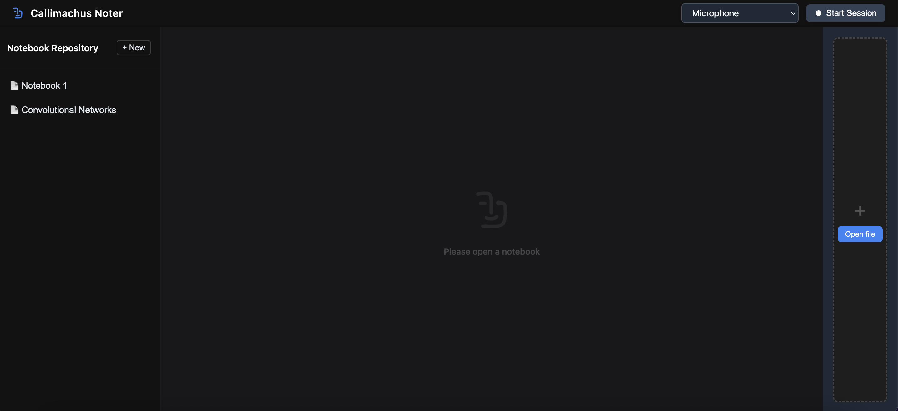
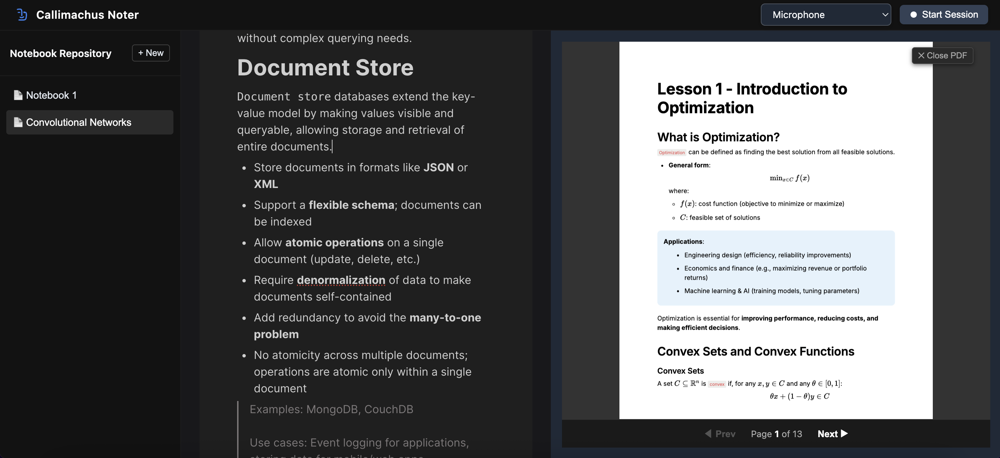
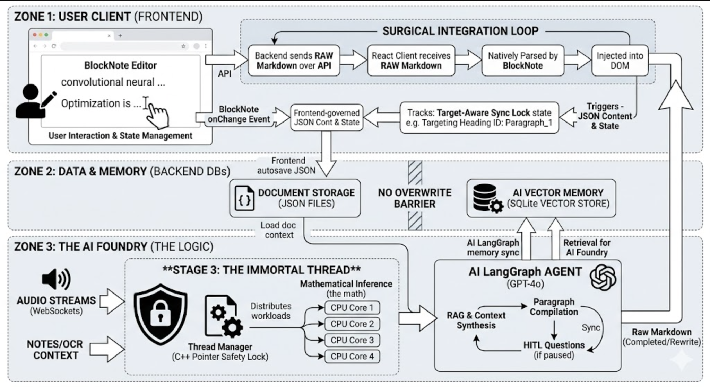
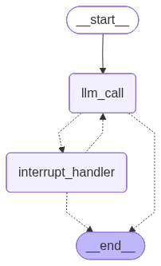
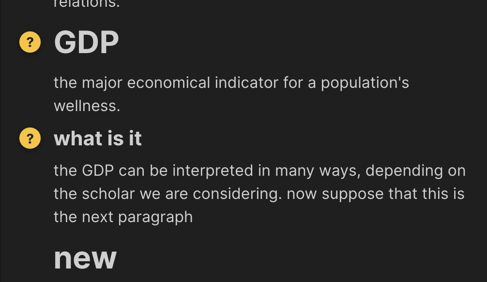
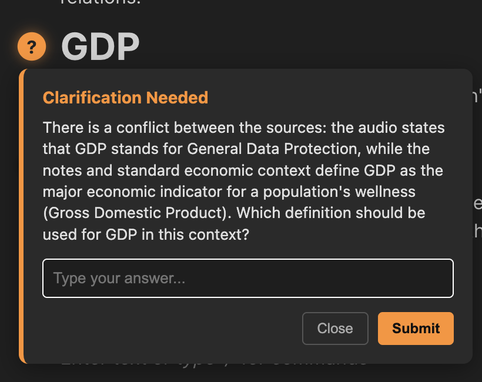
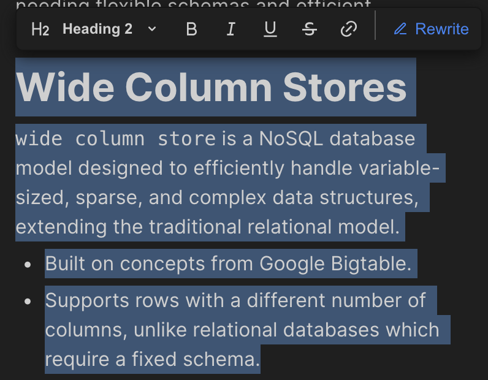
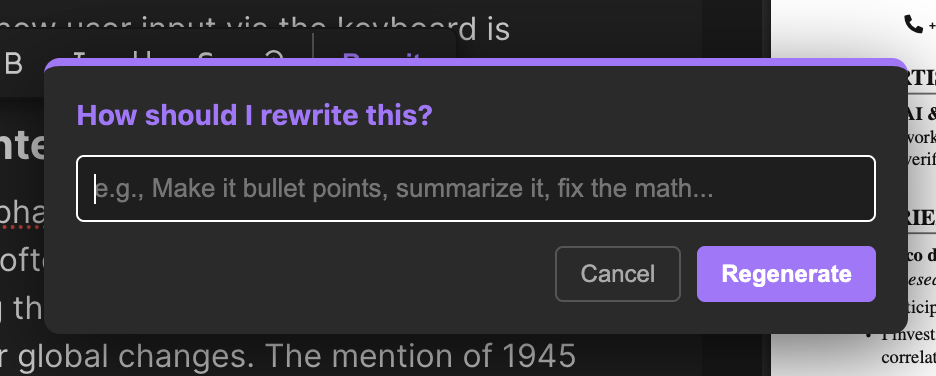

# Callimachus 2.0 - Agentic AI for Educational Content

**Created by Dario Gosmar**.

This project implements an Agentic AI assistant designed to process multiple types of educational inputs (audio transcriptions, slide text, handwritten notes) and integrate them into a structured markdown document that functions like a Notion notebook.

#### Overview

Callimachus 2.0 is designed to handle the complexity of multi-modal educational content by intelligently integrating simultaneous inputs into a structured document. The platform is divided into two main windows:

- **Media Window**: Displays PDF documents and slides, serving as the visual source for OCR data extraction.
- **Document Window**: A Notion-style markdown editor powered by `BlockNote`, where the user takes notes, edits text, and interacts with the AI.

#### Core Architecture & Engines

Instead of forcing one LLM to do everything, the backend utilizes a highly specialized, multi-agent LangGraph system:

- **The Agent Model (The Manager)**: Evaluates incoming multimodal payloads (audio, OCR, notes) to check for contradictions. It decides whether it has enough information to proceed or needs to pause execution to ask the user a clarifying question.
- **The Compiling Model (The Writer)**: Takes the raw data, applies formatting preferences, and writes the final markdown text using tools like `create_paragraph`.
- **The Memory Model (The Observer)**: Silently watches how you answer questions and request edits, permanently updating your profile preferences in the background.

#### Payload Extraction

The system captures the physical learning environment through two specialized pipelines:

- **Audio Pipeline (Continuous Stream)**: Uses WebSockets to stream audio to a FastAPI backend. It leverages Silero VAD (Voice Activity Detection) to chop audio during pauses, sending chunks to Faster-Whisper for blazing-fast, local real-time transcription.
- **PDF Pipeline (Stateful Data)**: Uses PyMuPDF (`fitz`) to instantly extract accurate digital text from slides. Extraction is triggered natively via browser `CustomEvent` listeners whenever the user changes the page in the Media Window, guaranteeing high performance without constant React re-renders.

#### Human-In-The-Loop (HITL) Feature

The multi-agent system features robust asynchronous communication to handle conflicting sources without disrupting the user's note-taking flow:

1.  **Pending Questions**: When the Agent Model detects a contradiction, it freezes the LangGraph thread using an `interrupt()` and sends the question to the frontend.
2.  **Yellow Dot Indicators**: Instead of a disruptive popup, a polite yellow dot appears in the margin next to the specific paragraph.
    
3.  **Resolution Popover**: When the user is ready, clicking the dot opens a popover to provide context. The user's answer updates the system's memory and unfreezes the graph to complete the paragraph generation.
    

#### Rewrite Requests & Active Learning

Users can actively request modifications to the compiled text directly through the UI.

When a rewrite is submitted:

1.  **Permanent Learning**: The `memory_model` instantly updates the "Compiler Profile" in RAM with the user's stylistic preference (e.g., "Make it a bulleted list").
2.  **Surgical Synchronization**: The agent regenerates the text, and the frontend perfectly hot-swaps the old UI blocks with the new markdown in the BlockNote editor, flashing green to indicate success.

#### Learning through agentic memory

The agent improves over time through a sophisticated dual-layer memory system that separates immediate task context from long-term user preferences.

- The first layer is the single-thread document memory (`MemorySaver`), which simply tracks the specific history and data gathered during the active conversation about a single document or paragraph.
- The second, more advanced layer is the cross-thread profile memory (`InMemoryStore`), which acts as the agent's persistent learning center.

This long-term memory is divided into two distinct profiles: the **Agent Profile**, which learns behavioral rules based on how you answer Human-in-the-Loop (HITL) clarification questions (e.g., learning that you prefer audio context over OCR when they conflict), and the **Compiler Profile**, which learns your specific stylistic and formatting preferences.

#### Execution Flow & Performance Management

To avoid React lag from constant audio/OCR injections, the Document Window tracks everything through a "Shadow Register" using `useRef`.

The user's notes are logically grouped into "Buckets" based on headings. Once the user stops modifying a bucket and moves the cursor away, a 20-second countdown begins. During this time, background audio and OCR strings are silently gathered in the bucket's hidden arrays. Once 20 seconds pass, the entire multimodal payload is bundled and sent to the LLM backend for processing.

#### Workflow Types

The system supports the following workflows:

1.  **Standard Processing**: Autonomous integration of audio, slides, and notes.
2.  **Human-in-the-Loop (HITL)**: Asynchronous conflict resolution using unobtrusive margin indicators.
3.  **Memory-Enabled**: Dual-layer memory system tracking single-thread document history and cross-thread behavioral profiles.

#### Future Enhancements

- Handle context overflow when a paragraph is deleted.
- **Advanced search**: Semantic similarity for better content placement across three sources.
- **Visual processing**: Direct image and diagram analysis from slides via Vision LLMs.
- **Collaborative features**: Multi-user document editing and shared learning spaces.
