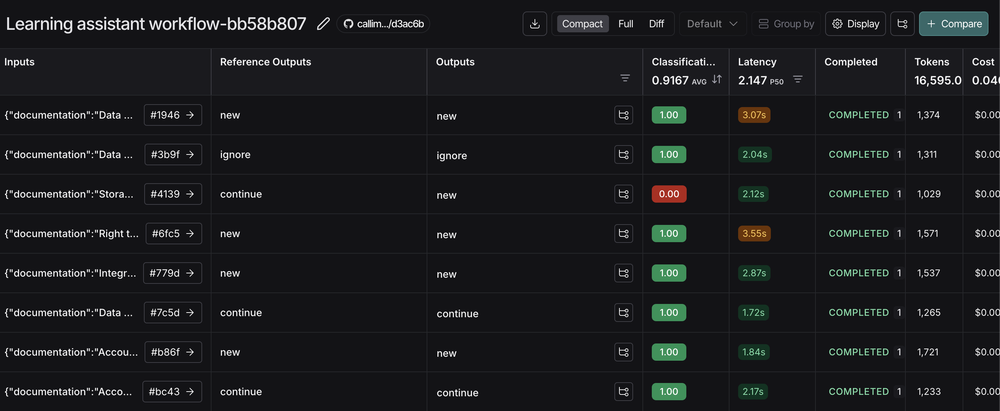
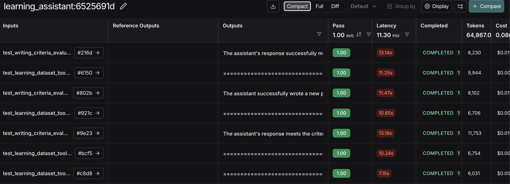

# Learning Assistant - Agentic AI for Educational Content

This project implements an Agentic AI assistant designed to process multiple types of educational inputs (audio transcriptions, slide text, handwritten notes) and integrate them into a structured markdown document that functions like a Notion notebook.

## Overview

The Learning Assistant is designed to handle the complexity of multi-modal educational content by intelligently integrating three simultaneous inputs into a structured document.

## Core Functionality

### Input Processing Model

The system processes **three simultaneous inputs** for each learning session:

- **Audio transcription**: Detailed explanations, context, and verbal insights from lectures
- **Slide text**: Structured content, key points, and visual information from presentations
- **Student notes**: Personal insights, emphasis, questions, and connections (handwritten or digital)

### Decision Making Process

For each set of three simultaneous inputs, the assistant:

1. **Analyzes all three sources** simultaneously to understand the complete learning context
2. **Decides placement strategy**:
   - Continue with current paragraph (content directly relates to existing section)
   - Resume an old paragraph (content relates to previously discussed topic)
   - Create new section (content introduces new topic)
3. **Synthesizes information** from all three sources into coherent, integrated content
4. **Enhances content** by adding visual aids when beneficial
5. **Asks for clarification** when sources conflict or information is unclear
6. **Marks completion** when three-source integration is finished

## Project Structure

```
src/learning_assistant/
├── __init__.py
├── configuration.py          # Configuration settings
├── learning_assistant.py     # Main assistant implementation
├── prompts.py               # Prompt templates for different workflows
├── schemas.py               # Data schemas and models
├── utils.py                 # Utility functions for content processing
└── tools/
    ├── __init__.py
    ├── base.py              # Tool management and loading
    └── default/
        ├── learning_tools.py      # Core learning assistant tools
        └── prompt_templates.py    # Tool-specific prompt templates
```

## Workflow Types

The system supports different workflow configurations for three-source processing:

1. **Standard Processing**: Autonomous integration of audio, slides, and notes
2. **Human-in-the-Loop (HITL)**: Includes user questions for resolving conflicts between sources -> **TODO**
3. **Memory-Enabled**: Maintains context across sessions for learning continuity -> **TODO**

## Getting Started

1. Install dependencies:

   ```bash
   # Create and activate a virtual environment (with name callimacus_env)
   python3 -m venv callimacus_env
   source callimacus_env/bin/activate

   # Ensure you have a recent version of pip (required for editable installs with pyproject.toml)
   python3 -m pip install --upgrade pip

   # Install the package in editable mode
   pip install -e .
   ```

2. Run the local deployment:
   ```bash
   source .venv/bin/activate && langgraph dev
   ```
3. Test input:

   ```python
   content_input = {
    "audio_transcription": "Let's talk about Storage Limitation, it's a principle that requires that personal data must not be maintained for longer than is necessary. For Example, suppose that an agent starts an action after eight years, nine years from the determination of the agreement, the employer do not have the optimal evidence, it's a proof for demonstrating, demonstrating for instance, that he acted in a lawful way, because he stored data for a period of time, not sufficient to the evidence, this is the foreman most trading, it's lawful, it's lawful behavior",
    "documentation": "Storage Limitation\nThe storage limitation principle requires that personal data must not be maintained for longer than is necessary to fulfil the goal of their collection. Data must be erased when the data processing purpose is achieved. This means that storing any data longer than necessary is not permitted (art. 5.1.e).",
    "student_notes": "### Storage Limitation: personal data must not be maintained for longer that is necessary",
    "document_thread": ""
   }
   ```

## Running Tests

We can run small tests on our system by using the `learning_dataset.py` dataset

### Testing Triage Router

We can run the command

```bash
python3 ./tests/test_triage.py
```

To see how the triage router classifies the inputs in the dataset, the final results can be seen in the langchain portal



### Testing Learning Assistant

We can then run our learning_assistant against a larger test suite.

```
! LANGSMITH_TEST_SUITE='Learning assistant: Test Full Response Interrupt' LANGSMITH_EXPERIMENT='learning_assistant' AGENT_MODULE=learning_assistant pytest tests/test_system.py
```



What the test does:

- We pass our dataset examples into functions that will run pytest and log to our `LANGSMITH_TEST_SUITE`
- We use LLM-as-judge with a grading schema:
- We evaluate the agent response relative to the criteria

## Future Enhancements

- **Advanced search**: Semantic similarity for better content placement across three sources
- **Conflict resolution**: Intelligent handling of contradictory information between sources
- **Multi-document support**: Managing multiple related documents and sessions
- **Visual processing**: Direct image and diagram analysis from slides
- **Collaborative features**: Multi-user document editing and shared learning spaces
- **Export formats**: PDF, HTML, and other output formats
- **Source weighting**: Configurable importance levels for different input types

## Configuration

The assistant can be configured for different educational contexts through the `configuration.py` file, including:

- Three-source integration preferences
- Content synthesis strategies
- Enhancement generation settings
- Document structure templates
- Conflict resolution patterns
- User interaction preferences
